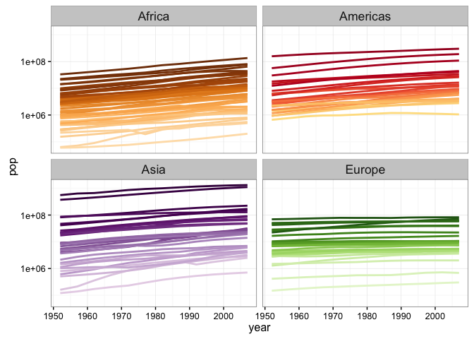

# Data from the Web

## Big picture

There are three ways to get data from the internet into R:

  * Make API queries "by hand" using httr.
  * Use an R package that wraps an API, such as the many from [rOpenSci](https://ropensci.org).
  * Scrape the web.

Pick one of the exercises below. At least one prompt is given for each of the above approaches.

**Due date: Friday 09 December 2016.**

## General requirements

Reproducibility

  * If your process involves obtaining some records (countries, species) at random, provide either the list of things chosen (id numbers, country codes etc.) OR use `set.seed()` so that a peer could produce the same random sample.

Security

  * Remember to protect any API keys or tokens, if your chosen API requires them! Don't commit and push those to GitHub.

Practicality

  * Be aware of rate limits on APIs when making repeated requests.
  * Don't download large data repeatedly during development. Consider breaking your work into separate scripts (e.g. download and analysis), using `make` or a makefile-like R script, or putting the download inside an `if()` statement that checks if the data already exists.

Reporting

  * Do, or at least, report your work in an R Markdown document.
  * What was most difficult? What are you most excited about in your future of getting data from the web? What questions did this raise in your mind?

## Make API queries "by hand" using httr.

Create a dataset with multiple records by requesting data from an API using the httr package.

Inspiration for APIs to call

  * From in-class activities:
    - Star Wars API: <https://swapi.co>
    - API of Ice and Fire: <https://anapioficeandfire.com>
    - OpenWeatherMap: <https://openweathermap.org/api>
    - Open Movie Database: <https://www.omdbapi.com>
  * Here is a huge list of APIs -- you should have no trouble finding one you have some interest in!
    - <http://www.programmableweb.com/category/all/apis>

`GET()` data from the API and convert it into a clean and tidy data frame. Store that as a file ready for (hypothetical!) downstream analysis. Do just enough basic exploration of the resulting data, possibly including some plots, that you and a reader are convinced you've successfully downloaded and cleaned it.

Take as many of these opportunities as you can justify to make your task more interesting and realistic,  to use techniques from elsewhere in the course (esp. nested list processing with purrr), and to gain experience with more sophisticated usage of httr.

  * Get multiple items via the API (i.e. an endpoint that returns multiple items at once) vs. use an iterative framework in R.
  * Traverse pages.
  * Send an authorization token. *The [GitHub API](https://developer.github.com/v3/) is definitely good one to practice with here.*
  * Use httr's facilities to modify the URL and your request, e.g., query parameters, path modification, custom headers.
  
## Scrape data

Work through the [final set of slides](https://github.com/ropensci/user2016-tutorial/blob/master/03-scraping-data-without-an-api.pdf) from the [rOpenSci UseR! 2016 workshop](https://github.com/ropensci/user2016-tutorial#readme). This will give you basic orientation, skills, and pointers on the rvest package.

Scrape a multi-record dataset off the web! Convert it into a clean and tidy data frame. Store that as a file ready for (hypothetical!) downstream analysis. Do just enough basic exploration of the resulting data, possibly including some plots, that you and a reader are convinced you've successfully downloaded and cleaned it.

I think it's dubious to scrape data that is available through a proper API, so if you do that anyway ... perhaps you should get the data both ways and reflect on the comparison. Also, make sure you not violating a site's terms of service or your own ethical standards with your webscraping. Just because you can, it doesn't mean you should!

## Use an R package that wraps an API

Many APIs have purpose-built R packages that make it even easier to get data from them.

If you choose one of these options, then you need to go further and combine two datasets, at least one of which is from the web.

### Specific ideas

These were developed in 2015 by TA Andrew MacDonald

**Prompt 1**: Combine [`gapminder`](https://github.com/jennybc/gapminder) and data from [`geonames`](http://www.geonames.org/). Install the `geonames` package (on [CRAN](https://cran.r-project.org/web/packages/geonames/index.html), on [GitHub](https://github.com/ropensci/geonames)). Make a user account and use `geonames` to access data about the world's countries. Use data from `geonames` and `gapminder` to investigate either of these questions:

  * What is the relationship between per-capita GDP and the proportion of the population which lives in urban centers?
  * Consider the following graph of population against time (a modification of Jenny's [gapminder demo](https://github.com/jennybc/gapminder)):
    

```r
library("ggplot2")
library("gapminder")

ggplot(subset(gapminder, continent != "Oceania"),
       aes(x = year, y = pop, group = country, color = country)) +
  geom_line(lwd = 1, show.legend = FALSE) + facet_wrap(~ continent) +
  scale_color_manual(values = country_colors) + theme_bw() +
  theme(strip.text = element_text(size = rel(1.1))) + scale_y_log10()
```

<!-- -->

Replace population with *population density*. To do this, look up the country codes in `geonames()`, obtain the area of each country and compute density as population divided by area. **TIP** check out the handy package [countrycode](https://github.com/vincentarelbundock/countrycode) to help you merge country names!

**Prompt 2**: Look at two other rOpenSci packages: [`rebird`](https://github.com/ropensci/rebird) and [`rplos`](https://github.com/ropensci/rplos). Both packages are on CRAN and more info is on their GitHub repo READMEs. Find out what data are available from each, and combine them! Here are three suggestions:

  * `rplos` and `rebird` -- how many articles are published on a bird species? 
  * `rplos` and `geonames` -- Choose a subset of countries. How many papers have been published by people from that country? In that country? How does that relate to GDP?
  * `rebird` and `geonames` -- Do countries with more bird species also have more languages?

**Prompt x**: Look through the rOpenSci [packages list](http://ropensci.org/packages/) and/or the [CRAN Task View on Web Technologies and Services](https://cran.r-project.org/web/views/WebTechnologies.html), find other wrapped APIs that interest you, and remix those instead.

## Rubric

Recall the [general homework rubric](http://stat545-ubc.github.io/peer-review01_marking-rubric.html).

Peers and/or TAs will run the code and try to get the same output. You'll be evaluated on the clarity and robustness of your workflow.
